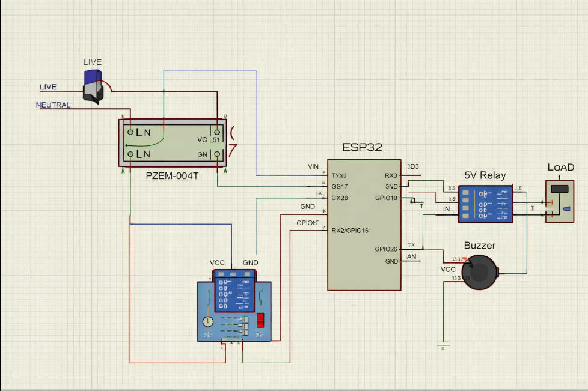
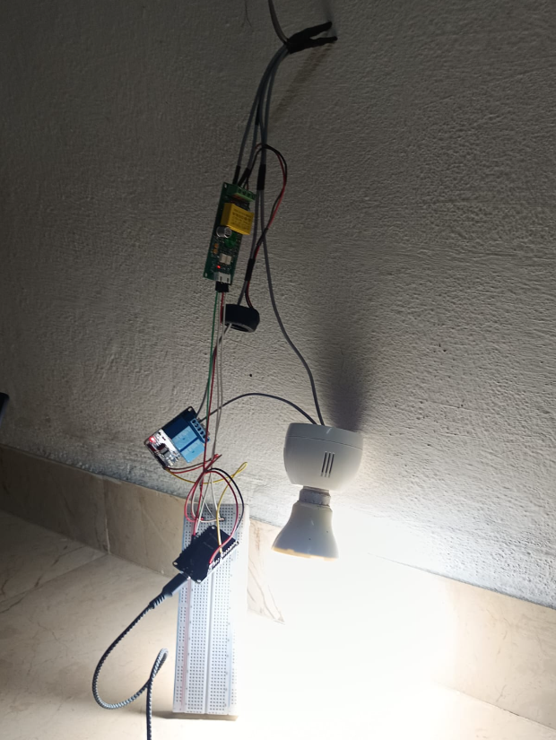

# IoT-Based Smart Energy Meter with Electrical Tampering Detection and Protection

## Project Overview

The IoT-Based Smart Energy Meter is designed to monitor electrical parameters in real time and detect abnormal electrical conditions that may indicate tampering.

The system uses an ESP32 and PZEM-004T energy monitoring module to measure electrical parameters such as voltage, current, power and energy consumption. The collected data can be monitored remotely through an IoT platform.

The system also includes electrical tampering detection and a protection mechanism. When a partial bypass or other abnormal condition is detected, the system generates an alert and disconnects the power supply through the protection mechanism.

## Key Features

- Real-time voltage measurement
- Real-time current measurement
- Power measurement
- Energy consumption monitoring
- IoT-based remote monitoring
- Electrical tampering detection
- Partial bypass detection
- Automatic power disconnection during detected tampering
- Alert generation

## Components Used

- ESP32
- PZEM-004T Energy Meter Module
- Relay Module
- Buzzer
- AC Load
- Connecting Wires
- Breadboard / Prototype Connections

## System Working

1. The PZEM-004T measures the electrical parameters of the connected load.
2. The ESP32 reads the measured voltage, current, power and energy values.
3. The ESP32 processes the measured data and monitors the electrical condition.
4. The measured data is transmitted to an IoT platform for remote monitoring.
5. The system continuously checks for abnormal electrical conditions.
6. When a partial bypass or tampering condition is detected, an alert is generated.
7. The protection mechanism disconnects the power supply to the load.

## System Connection Diagram

The following diagram illustrates the connections between the PZEM-004T,
ESP32, relay module, buzzer and the connected load.

## Hardware Implementation

The prototype was implemented using an ESP32, PZEM-004T and supporting components for real-time energy monitoring and tampering detection.

## IoT Monitoring

The measured electrical parameters are transmitted to the ThingSpeak IoT platform for remote monitoring and visualization.

## Energy Measurement Results

The system successfully measures electrical parameters such as voltage, current, power and energy consumption using the PZEM-004T module.

## Tampering Detection and Protection

The system detects abnormal electrical conditions such as partial bypass tampering. When tampering is detected, the system generates an alert and disconnects the power supply through the protection mechanism.

## Protection Mechanism

When a tampering condition is detected:

- The system generates an alert.
- The buzzer provides an indication of the abnormal condition.
- The relay disconnects the power supply.
- The system displays a tampering alert.
- Power restoration requires the specified recovery procedure.

## Technologies Used

- ESP32
- PZEM-004T
- ThingSpeak IoT Platform
- Embedded C / Arduino Programming
- Electrical Energy Monitoring
- Tampering Detection
- Relay-Based Protection

## Source Code

The complete ESP32 source code used for the smart energy meter and tampering detection system is included in this repository.

The code implements:

- PZEM-004T electrical parameter measurement
- Voltage and current monitoring
- Power and energy measurement
- Full bypass detection
- Partial bypass detection
- Overload detection
- Buzzer-based alert
- Relay-based power disconnection
- Password-based power restoration

Source file:

`Smart_Energy_Meter.ino`

## Applications

- Smart energy monitoring
- Electrical theft detection
- Residential energy monitoring
- Industrial energy monitoring
- Electrical tampering detection
- IoT-based power monitoring systems

## Safety Notice

This project involves electrical AC mains connections. The hardware implementation should only be handled with proper electrical safety precautions and appropriate supervision. Do not work on live electrical connections.

## Project Outcome

The developed prototype demonstrates real-time electrical parameter monitoring, IoT-based data visualization, electrical tampering detection and automatic power disconnection during detected abnormal conditions.
